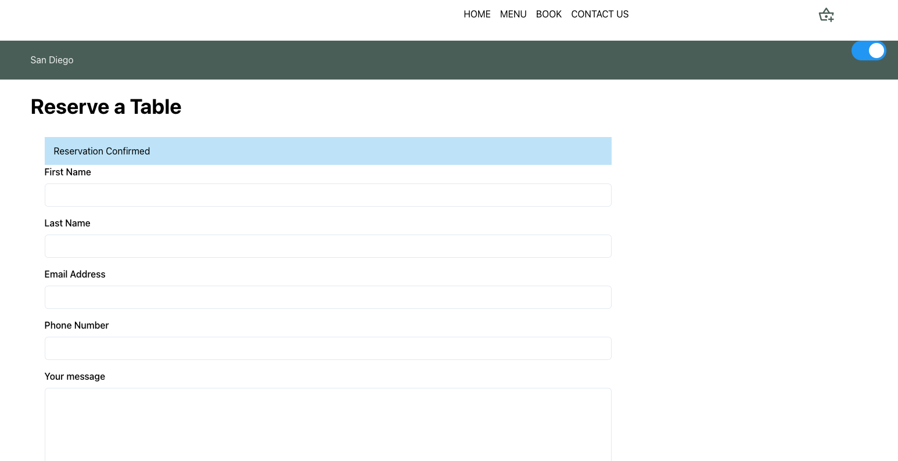

# Lemon Restaurant Project for Meta Certification

 

## how to run
1- git clone
2- npm i 
3- npm run start

## What's included
1- Figma style guide
2- Wireframe
3- Journey map
4- React App
5- Prototype
6- Assets

## Pages Included 

1- Home
2- Book or reservation form
3- Contact us
4- Menu 
5- Menu Items

## Features 
1- Dark light theme
2- onClick Routes
3- Params usage
4- Formik
5- Yup Validation
6- Menu list and items as const within App.js
7- Bootstrap
8- Responsive with Menu Nav
9- Simple test case
10- propTypes
11- React Hooks like useEffect, useState, ...
12- Accessibility 
13- ESlint and pretier
14- Build version to serve

